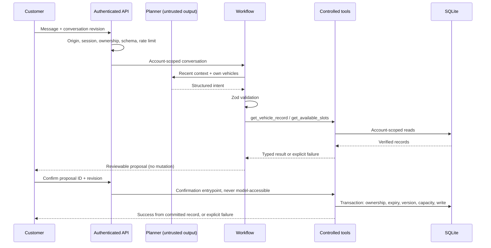

# Architecture and decisions

## The authority boundary

The planner answers **“what is the customer trying to do?”** The workflow answers **“what can we safely do next?”** The tool layer answers **“does this operation satisfy business rules right now?”**

## Modules

| Module                   | Responsibility                                                                                                  |
| ------------------------ | --------------------------------------------------------------------------------------------------------------- |
| `src/shared/domain.ts`   | Shared domain types, public conversation projection, strict planner schema                                      |
| `src/server/planner.ts`  | Provider-independent `Planner` contract, OpenAI/Anthropic adapters, clearly labelled fixture planner            |
| `src/server/agent.ts`    | Finite conversation workflows, context retention, tool-derived wording, proposals and truthful failure handling |
| `src/server/tools.ts`    | Tool allowlist, strict argument validation, ownership and confirmation gates, traces, fault injection           |
| `src/server/store.ts`    | Schema, fictional seeds, scoped records, transactions and persisted model-call budget                           |
| `src/server/time.ts`     | Copenhagen calendar arithmetic, independent of server timezone                                                        |
| `src/server/index.ts`    | HTTP authorization, origin checks, limits, sessions, internal routes and static serving                         |
| `src/client/components/` | Customer, operations, lab, trace inspector and portfolio views                                                  |
| `evals/`                 | Scenario definitions, isolated runner, immutable timestamped run evidence                                       |

## Why not a free-running tool agent?

This workflow has a small action space. One structured model call followed by a deterministic state transition is easier to test and cap than an open-ended loop. It still uses a real language model in live mode to interpret symptoms, intent, corrections, dates and vehicle references. The LLM does not compose final operational facts or obtain a mutation capability. This is a constrained agent workflow, not an autonomous general-purpose agent.

The tradeoff is deliberately conservative dialogue. Multi-intent requests prioritize safety, then human review, then the primary action. The system does not queue several unrelated bookings from one message. Offline mode has limited vocabulary; live mode requires measured evaluation before quality claims.

## Tools

All tool names come from an explicit allowlist, and their arguments use strict Zod objects. No account ID is accepted from planner arguments; the authenticated conversation supplies it.

| Tool                       | Contract                                                                             |
| -------------------------- | ------------------------------------------------------------------------------------ |
| `get_workshop_information` | Static verified workshop policy, hours and identity                                  |
| `get_available_services`   | Published catalogue with assessment prices and scope                                 |
| `get_available_slots`      | Future weekday availability for one service, optionally one date                     |
| `get_booking`              | Owned reference or owned booking list; foreign and missing references look identical |
| `get_vehicle_record`       | Owned vehicle or own vehicle list                                                    |
| `create_booking`           | Current owned proposal + confirmation entrypoint + fresh capacity                    |
| `modify_booking`           | Same requirements plus current booking version; old booking stays until commit       |
| `cancel_booking`           | Same consent/ownership/version requirements; state change, not row deletion          |
| `create_service_request`   | Captures the issue without diagnosing it or promising resolution                     |
| `escalate_to_human`        | Structured handoff; refreshes existing context and only raises urgency               |

Every tool returns either `{ok:true,data}` or `{ok:false,error:{code,message}}`. Errors are never cast into success. Fault controls inject a one-shot failure at this boundary. Timeouts and unavailable systems are simulated error results; they are not evidence of an actual external outage. Real provider HTTP timeouts are separately enforced by the SDK.

## Facts and context

- **Known:** the customer said something. This establishes an utterance, not the truth of the claim.
- **Inferred:** planner interpretation of a requested workflow. It carries no operational authority.
- **Unknown:** information unavailable to this system, such as a repair completion deadline.
- **Tool-verified:** a record returned by the fictional workshop system, such as a vehicle or offered slot.

The workflow retains vehicle, service, date, time and booking reference across turns. Explicit corrections replace those fields. Any new message invalidates the previous proposal, including a simple text “yes”; a new proposal may be issued, but only its confirmation button can commit it. Withdrawals clear pending context. Proposals expire after ten minutes and do not reserve capacity.

## Scheduling and persistence

The seed creates three fictional customers, three vehicles, six services, three technicians and a rolling 21-day scheduling window. Availability starts tomorrow, Monday–Friday, at 08:00, 09:30, 11:00, 13:00 and 14:30 Copenhagen time. The uniform 90-minute blocks are intentionally conservative: even a 30-minute tyre assessment consumes a full block. There are deterministic gaps in capacity; two example appointments are seeded on first creation.

A confirmed booking consumes a technician/time block across services. The transaction rechecks capacity and optimistic booking version. A partial unique index also rejects two active bookings for the same slot. SQLite transactions and the single process serialize commits. Multi-worker hosting is explicitly unsupported without shared locks and a stronger resource reservation schema.

Sessions and business records persist in SQLite. A per-conversation in-memory lock rejects overlapping HTTP actions; a revision number rejects stale browser state. Proposal replay after normal completion fails because the proposal is removed. A process crash between the booking transaction and conversation persistence remains a documented recovery gap; do not mistake normal replay tests for distributed exactly-once guarantees.

## Human handoff

Handoffs contain customer, known vehicle, summary, intent, known/inferred/verified facts, attempted actions, reason, urgency and relevant tool results. They are an internal queue, not a delivered email or a real adviser response. A later urgent issue updates the existing queue entry. Trace results return only handoff identifiers/status to avoid recursive embedding of entire prior handoffs. A failed handoff is not presented as successful; one bounded fallback attempt may succeed after a one-shot injected error.

## Replacing the workshop backend

`Planner` is already an explicit provider seam. The workshop replacement seam is the typed tool result contract plus `Store` methods. The current SQLite implementation is deliberately concrete, and some tool write logic is SQL-specific. A production DMS adapter is **not** implemented or claimed.

To add one: implement scoped customer/vehicle/booking reads and capacity queries behind a `WorkshopGateway`; move SQL writes behind that adapter; retain tool validation and consent checks; implement upstream conditional updates/idempotency keys and schema-validate every external response. A timeout after an external write has **unknown outcome**, not necessarily failure. Reconcile by idempotency key before telling the customer no booking occurred. The local injected timeout is always pre-commit, so the current wording is accurate only for this local backend.

## Why this stack

One TypeScript codebase makes domain contracts easy to follow. Express keeps the API boundary explicit. React has no agent-specific UI framework; the customer never needs to understand tools. Local fonts and a small CSS system make the presentation independent of third-party CDNs. SQLite is inspectable and transactional; it trades multi-instance deployment flexibility for a reproducible local demonstration. Avoiding a free-running loop, vector database and unnecessary microservices keeps the engineering decisions explainable.

## Verification changes

`constraints.ts` and explicit clarification state distinguish unresolved fields from absent preferences, clear stale corrections, and prevent first-match selection of competing vehicles/dates. Known foreign vehicle IDs are rejected before context merge, and escalation checks ownership independently. Safety advice remains mandatory even when the handoff fails. Planner objects are strict and validate real calendar/time values. The tool layer enforces eight attempts per turn.

Anthropic now uses a forced classification tool; OpenAI keeps strict JSON schema output. Both record bounded per-request diagnostic observations keyed to the conversation. Mock-transport tests do not establish live-provider quality. The evaluation wrapper owns a shared run-wide call cap independent of scenario databases. See docs/verification for preserved failures and evidence.

## Public portfolio hosting adapter

`api/demo.ts` exports a separate simulation-only entry point. `public-demo.ts` uses the same Store/Agent/ToolLayer as local mode, restoring an isolated SQLite database from AES-GCM encrypted state in request bodies. No request depends on a previous function instance or local disk. `demo-state.ts` enforces authentication, expiry and size bounds; every request closes its database. The UI stores the ciphertext only in tab sessionStorage.

Public Operations and evaluation routes serve `portfolio-evidence.json`, generated deliberately from known fictional conversations and hash-attributed real simulation reports. They never query visitor databases. Mutating internal controls are unavailable publicly. The local server and token-protected engineering console retain their original purpose.

This hosting adapter deliberately permits temporary session replay/forks and offers no global workshop capacity or durable appointments. It is a portfolio demonstration, not a replacement for a production transactional database. See DEPLOYMENT.md for exact limits and remaining cloud verification. OpenAI/Anthropic adapters remain implemented but live-provider evaluation was intentionally not performed.
