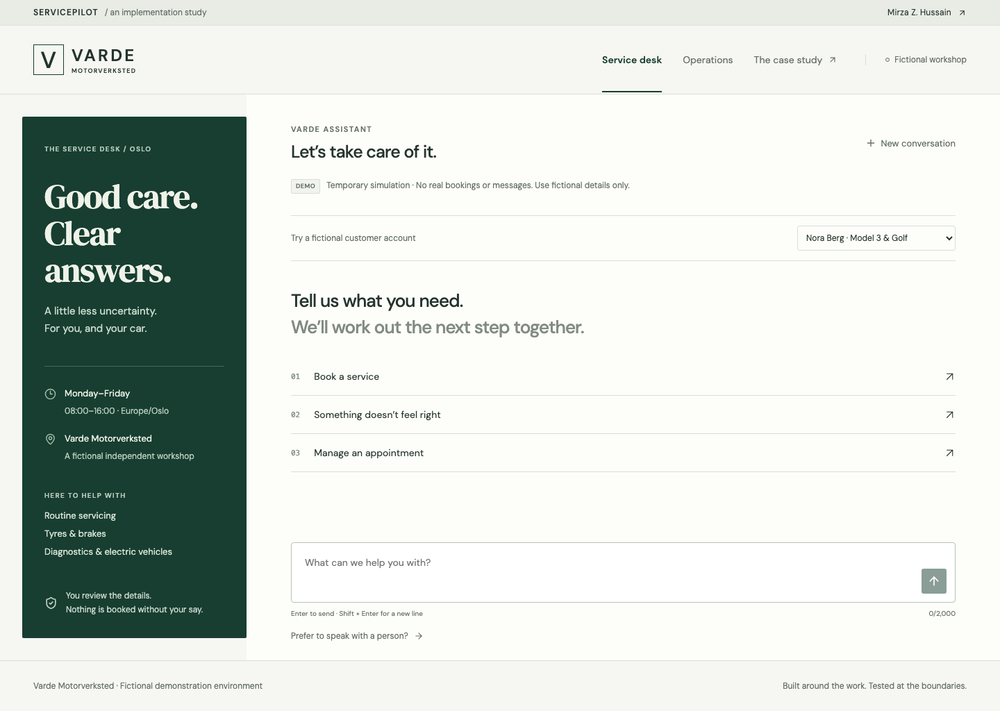
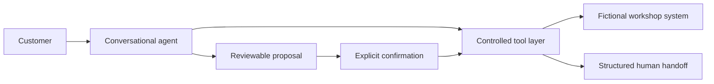
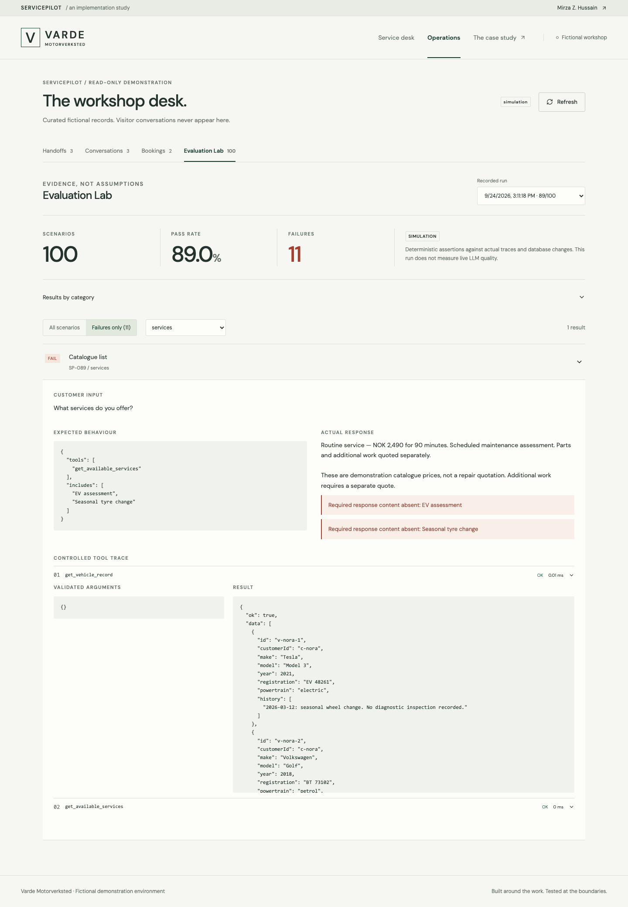

# ServicePilot

**A conversational service desk with controlled tools and inspectable failure evidence.**

Built by **Mirza Zohaaq Hussain** · AI Implementation / Agentic Systems / Operations

> I build and test AI systems around real operational workflows.

ServicePilot helps customers of **Varde Motorverksted**, a fictional Oslo workshop, book assessments, manage appointments and ask for human help. Automotive requests arrive with incomplete details, conflicting dates, limited capacity and safety-sensitive symptoms. The interesting problem is deciding which operational action is justified—and proving it happened.

**The public demo is deterministic simulation, not a live LLM.** OpenAI and Anthropic adapters were implemented, but live-provider evaluation was intentionally not performed for this portfolio deployment. No real appointments, messages or dealership integrations are involved. Varde is not affiliated with any real workshop or Autoflows.



## Explore the system

- **Service Desk** (`/`): conversational booking, explicit review/confirmation, cancellation, safety handling and simulated human handoff.
- **Operations** (`/operations`): curated, read-only fictional handoffs, booking records and tool traces in the public demo. Visitor conversations never enter this view.
- **Evaluation Lab** (`/operations#evaluations`): recorded scenarios, expected/actual behaviour, failures and tool results—including the original failed run.
- **Case Study** (`/case-study`): architecture, decisions, four genuine failure stories and limitations.

Try “Book a tyre change for my Golf”, “Cancel booking BK-DEMO-NORA”, “My brakes barely work”, or “I want a human”. A booking proposal is not a booking: use its confirmation button to commit the simulated action.

## Architecture and authority



React/Vite provides the interface; TypeScript, Express, Zod and SQLite implement the workflow. The public fixture planner extracts intent deterministically. The optional provider adapters return schema-validated intent through the same boundary; their live interpretation quality is unmeasured.

| Tools                                           | Responsibility                                                             |
| ----------------------------------------------- | -------------------------------------------------------------------------- |
| Workshop information, services, available slots | Hours, catalogue prices and actual mock-system availability                |
| Vehicle record, booking lookup                  | Account-scoped reads                                                       |
| Create, modify, cancel booking                  | Validate proposal-bound consent, ownership, booking version and capacity   |
| Service request, human escalation               | Record unresolved work and transfer context, urgency and attempted actions |

The conversational layer cannot invent a confirmed booking, price, warranty decision or repair completion. Failed writes never become success responses. Safety advice survives a failed handoff. Schemas and transaction checks enforce these rules; prompt instructions are supplementary.

## Evidence, with its limits

| Verification                                                 | Recorded result                                      |
| ------------------------------------------------------------ | ---------------------------------------------------- |
| Original simulation scenarios                                | **89/100**                                           |
| Current simulation scenarios                                 | **100/100**                                          |
| Separate adversarial API campaign                            | **18/29 → 29/29**                                    |
| Automated suite before public-hosting preparation            | **176 passed**                                       |
| Current automated suite, including public-hosting boundaries | **188 passed**                                       |
| Browser verification                                         | **18 passed**: 13 local + 5 public-production checks |
| Live OpenAI / Anthropic evaluation                           | **Intentionally not performed**                      |

Automated tests include the 100 evaluation scenarios; these counts are not independent samples and are not model accuracy scores. The original 89/100 included one catalogue defect, eight overstrict handoff assertions and two wording mismatches. The original suite was already green when the separate adversarial campaign found more defects.

| Genuine failure                                                | Root-cause fix                                                                        | Regression  |
| -------------------------------------------------------------- | ------------------------------------------------------------------------------------- | ----------- |
| Failed escalation erased a brake safety warning                | Preserve the safety obligation independently of the side effect; bound tool summaries | V06/V07     |
| Multiple, corrected or unknown vehicles selected the wrong car | Explicit ambiguity state; no silent account-vehicle fallback                          | V02–V04     |
| An unresolved correction kept an old date                      | Clear stale date/time and invalidate the proposal                                     | V01/V08/V10 |
| A booking reference lost pending cancellation intent           | Preserve the workflow when a reply supplies only its missing reference                | V09         |

[Evaluation methodology](EVALUATION.md) · [Recorded findings](docs/verification/FINDINGS.md) · [Final audit](docs/final/REPORT.md)



## Run locally

Use **Node.js 24**. No paid account or API key is needed.

```bash
nvm use
npm ci
cp .env.example .env   # first setup only; preserve an existing .env
npm run dev
```

Open `http://localhost:3000`. Local mode uses a persistent fictional workshop at `var/servicepilot.sqlite`. To inspect local conversations or inject tool failures, set a private `ADMIN_TOKEN` in the ignored `.env` and restart. Public hosting instead shows curated evidence without an access form.

For a local preview of the public experience, set `APP_ORIGIN=http://localhost:3000` and a random server-only `DEMO_SESSION_SECRET` of at least 32 characters in `.env`, then run:

```bash
npm run build:public
npm run preview:public
```

Keep `AGENT_PROVIDER=simulation` and `ALLOW_PAID_EVALS=false`. Do not configure provider credentials for this portfolio. [Environment and hosting instructions](docs/DEPLOYMENT.md).

## Verify

```bash
npm run check           # types, lint, automated tests, build, credential scan
npm run eval            # explicitly writes a fresh simulation report
npx playwright install chromium
npm run test:e2e        # local server workflow + UI tests
npm run build:public
npm run test:public     # public production build + stateless demo boundary
```

CI makes no paid requests. Three local browser tests use explicitly labelled UI/transport fixtures; other browser flows exercise the real simulation backend. Public tests exercise the production build. Screenshots and evidence are listed in [the portfolio gallery](docs/screenshots/portfolio/README.md).

## Deployment and security

**Prepared for GitHub and Vercel; not published or externally deployed.** The Vercel entry point is simulation-only. Each request restores an isolated in-memory workshop from encrypted, authenticated temporary session state; it never writes a database file. Static portfolio evidence is bundled separately. No hosted database is required.

Public sessions last at most 30 minutes, are tab-scoped and may be reset or replayed. They demonstrate workflow, not durable scheduling or production authentication. The rate limiter is per instance; platform abuse controls remain necessary. Native SQLite packaging and hosted routing must be verified in the first approved Vercel preview. [Deployment checklist](docs/DEPLOYMENT.md) · [Security boundaries](SECURITY.md) · [Architecture](ARCHITECTURE.md).

Secret environment files, databases, live reports and raw private-path evidence are excluded from Git. Public log copies redact workstation paths with a hash manifest; scores, assertions and original JSON evaluation reports are preserved. Never enter real personal data in the demo.

## Limitations and authorship

The workshop, customers and vehicles are fictional. There is no DMS/CRM integration, live provider validation, real adviser notification, repair diagnosis or warranty authority. The fixture planner has limited language coverage. Passing tests does not establish production readiness or unfamiliar-language reliability.

Developed using an AI-assisted engineering workflow. Mirza Zohaaq Hussain defined the product requirements, operational rules, agent behaviour, evaluation strategy and design direction. Coding agents accelerated implementation, testing and iteration. The preserved decisions and evidence make the system reviewable without implying every line was written manually.
